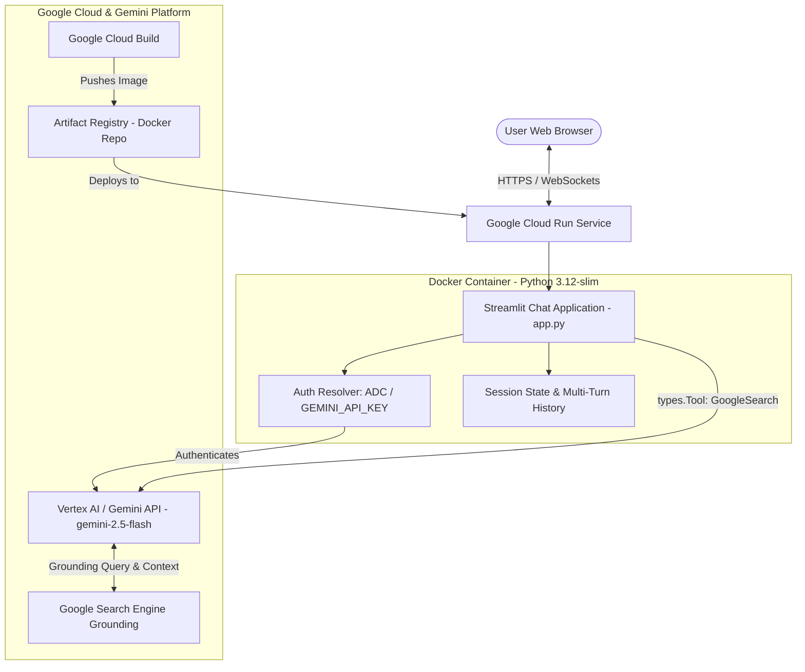

# Gemini AI Chatbot with Real-Time Google Search Grounding

A production-ready, interactive web-based AI Chatbot powered by **Google Gemini** (`gemini-2.5-flash`), built with **Streamlit**, and containerized for deployment on **Google Cloud Run**.

The chatbot features real-time **Google Search Grounding**, enabling the model to retrieve up-to-the-minute web facts, verify answers, and provide clickable citations with source domains and search query metadata.

---

## 🌟 Key Features

- **Gemini 2.5 Flash Engine**: Leverages Google's flagship multimodal model via the official `google-genai` SDK.
- **Real-Time Google Search Grounding**: Integrates `types.Tool(google_search=types.GoogleSearch())` to fetch current world facts and eliminate hallucinations.
- **Verifiable Citations & Sources**: Captures search queries and returns collapsible source cards with clickable URLs and domain tags.
- **Multi-Turn Conversation State**: Maintains full session context across message exchanges using Streamlit session state and Gemini history objects.
- **Dual Authentication Modes**:
  - **Vertex AI Mode**: Uses Google Cloud Application Default Credentials (ADC) without requiring hardcoded API keys.
  - **Developer API Key Mode**: Supports `GEMINI_API_KEY` for quick development and testing outside GCP.
- **Real-Time Token Streaming & Unary Modes**: Toggle between live streaming text generation and instant unary output.
- **Cloud Run Optimized**:
  - Production-ready `Dockerfile` with non-root security (`appuser`).
  - Dynamic binding to the Cloud Run `$PORT` environment variable.
  - Built-in container health check endpoint (`/_stcore/health`).
- **One-Click Deployment Automation**: Includes `deploy.sh` script to configure APIs, build container images via Cloud Build, and deploy to Cloud Run.

---

## 🏗️ Architecture



---

## 📂 Project Structure

```
Challenge-4-ai-Chatbot/
├── app.py                # Main Streamlit Chat application with Google Search grounding
├── requirements.txt      # Pinned Python dependencies (google-genai, streamlit, etc.)
├── Dockerfile            # Multi-stage/lightweight production container definition
├── deploy.sh             # Automated Cloud Run deployment script
├── test_app.py           # Unit and integration test suite
├── .streamlit/
│   └── config.toml       # Streamlit production server and theme settings
├── .dockerignore         # Docker build exclude rules
├── .gcloudignore         # Cloud Build exclude rules
└── README.md             # Project documentation and deployment guide
```

---

## 🚀 Quickstart & Local Development

### Prerequisites
- Python 3.11 or 3.12
- Google Cloud SDK (`gcloud`) authenticated, or a valid `GEMINI_API_KEY`

### 1. Install Dependencies
```bash
python3 -m venv .venv
source .venv/bin/activate
pip install -r requirements.txt
```

### 2. Configure Authentication

**Option A: Vertex AI (Recommended on GCP)**
```bash
gcloud auth application-default login
export GOOGLE_CLOUD_PROJECT="your-gcp-project-id"
export GOOGLE_CLOUD_LOCATION="us-central1"
```

**Option B: Gemini API Key**
```bash
export GEMINI_API_KEY="AIzaSy..."
```

### 3. Run the Chatbot
```bash
streamlit run app.py
```
Open [http://localhost:8501](http://localhost:8501) in your browser.

---

## 🧪 Running Tests

Run the test suite to verify client authentication, grounding info parsing, and live Gemini search grounding calls:

```bash
python3 test_app.py
```

---

## 🐳 Containerization with Docker

### Build the Image
```bash
docker build -t gemini-ai-chatbot:latest .
```

### Run Container Locally
```bash
docker run -p 8080:8080 \
  -e GOOGLE_CLOUD_PROJECT="your-gcp-project-id" \
  -e GEMINI_API_KEY="your-api-key" \
  gemini-ai-chatbot:latest
```
Access the application at [http://localhost:8080](http://localhost:8080).

---

## ☁️ Automated Cloud Run Deployment

The included `deploy.sh` script automates the complete provisioning and deployment pipeline:

1. Enables required Google Cloud APIs (`run`, `artifactregistry`, `aiplatform`, `cloudbuild`).
2. Creates an Artifact Registry Docker repository if not already present.
3. Submits a Cloud Build to package the container image securely without requiring a local Docker daemon.
4. Deploys to Google Cloud Run with autoscaling (0 to 10 instances), 1 vCPU, 1 GiB memory, and dynamic `$PORT` handling.
5. Emits the public live application URL upon completion.

### Deployment Commands

**Standard Deployment:**
```bash
./deploy.sh
```

**Customized Deployment:**
```bash
./deploy.sh \
  --project "my-gcp-project" \
  --region "us-central1" \
  --service "gemini-ai-chatbot" \
  --repo "chatbot-repo"
```

**Authenticated Deployment (Restricted IAM access):**
```bash
./deploy.sh --authenticated
```

---

## 🔍 How Search Grounding Works

The application uses the `google-genai` Python SDK to bind Google Search grounding directly into the generation request:

```python
from google.genai import Client, types

client = Client(vertexai=True, project="my-project", location="us-central1")

# Configure Google Search as an active tool
config = types.GenerateContentConfig(
    temperature=0.7,
    tools=[types.Tool(google_search=types.GoogleSearch())]
)

# Start multi-turn conversation
chat = client.chats.create(model="gemini-2.5-flash", config=config)
response = chat.send_message("What are today's top tech headlines?")

# Extract grounding metadata
if response.candidates and response.candidates[0].grounding_metadata:
    gm = response.candidates[0].grounding_metadata
    queries = gm.web_search_queries       # e.g., ['tech news September 2026']
    sources = gm.grounding_chunks         # e.g., [{web: {title: '...', uri: '...'}}]
```

---

## 🛡️ Security Best Practices

- **Non-Root Execution**: Runs as user `appuser` (UID 1000) inside the container.
- **Dynamic Port Injection**: Respects Cloud Run's `$PORT` environment variable.
- **Application Default Credentials**: Seamlessly uses Cloud Run's attached service account without embedding secrets into images.
- **Clean Image Footprint**: Excludes caches, secrets, and repository history via `.dockerignore` and `.gcloudignore`.
